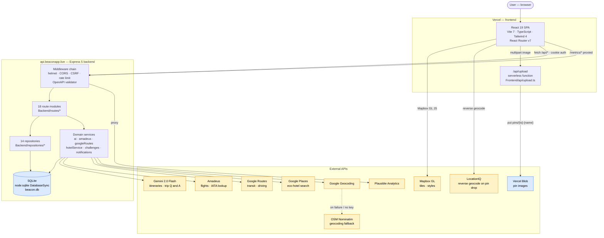
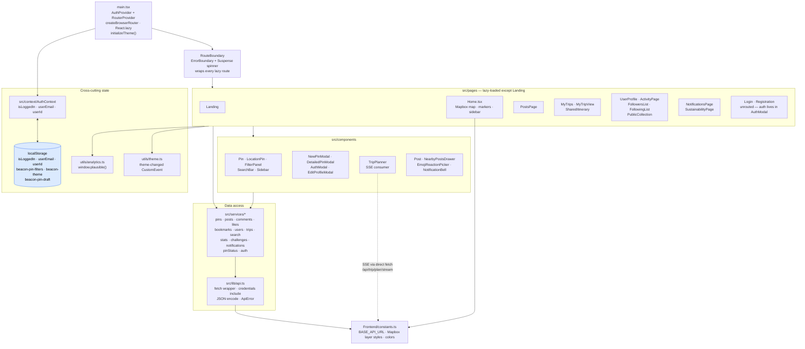
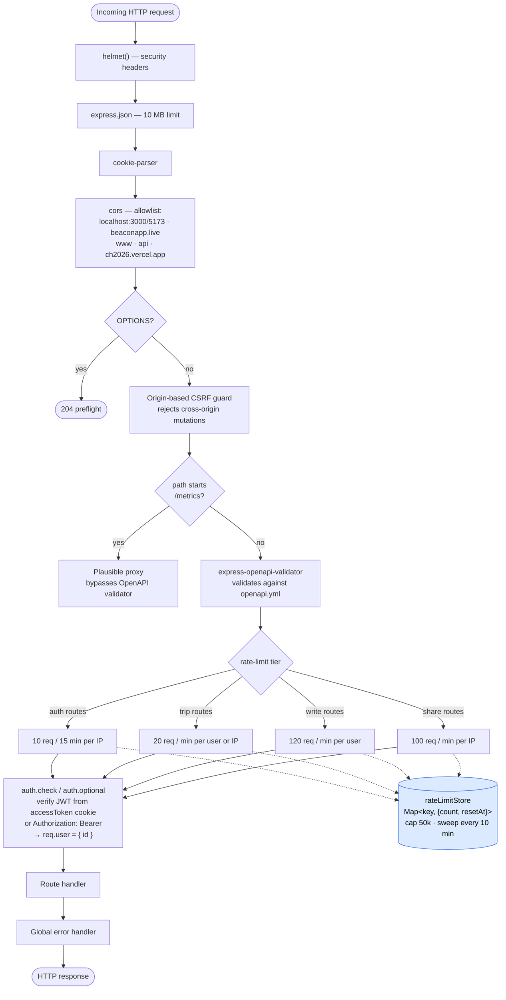
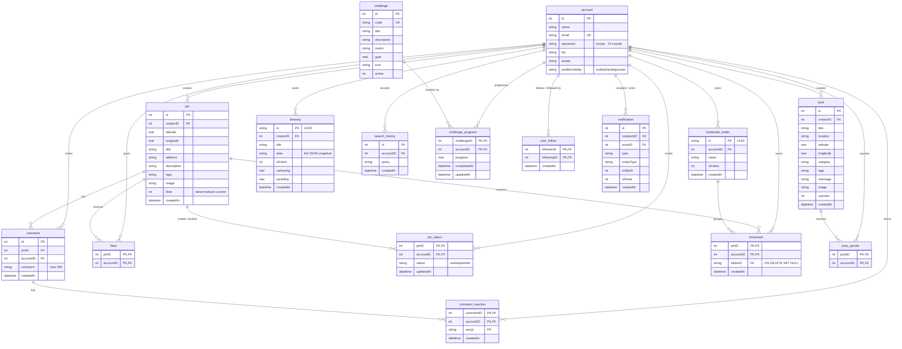
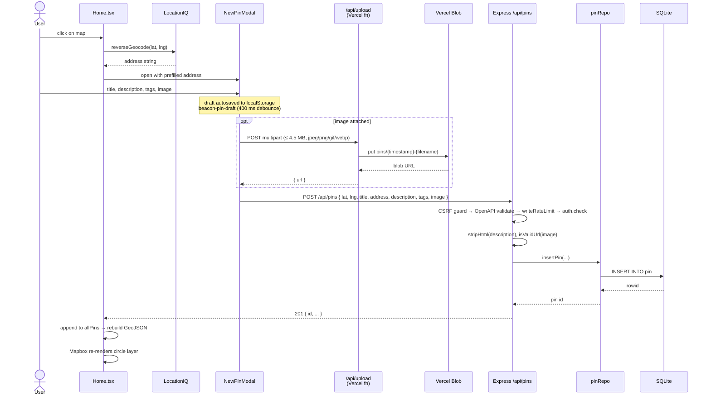
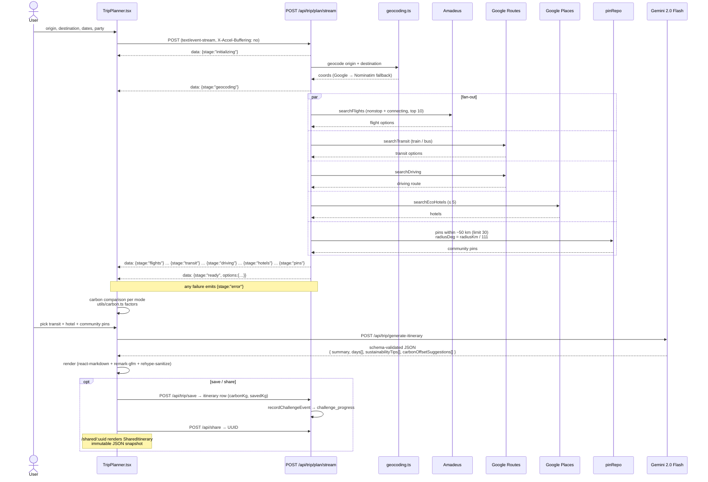
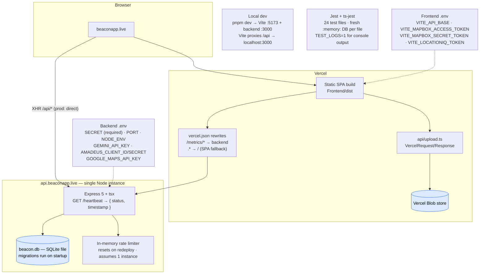

# Beacon — Architecture Diagrams

Mermaid diagrams describing the Beacon monorepo as it exists today (frontend service
layer + backend repository layer both in place). Render on GitHub, in VS Code with the
Mermaid extension, or at <https://mermaid.live>.

Contents:

1. [System context](#1-system-context)
2. [Frontend module structure](#2-frontend-module-structure)
3. [Backend request pipeline](#3-backend-request-pipeline)
4. [Backend layering: routes → repositories → SQLite](#4-backend-layering)
5. [Database ER model](#5-database-er-model)
6. [Sequence: dropping a pin](#6-sequence--dropping-a-pin)
7. [Sequence: two-phase trip planning over SSE](#7-sequence--two-phase-trip-planning)
8. [Deployment topology](#8-deployment-topology)

---

## 1. System context

---

## 2. Frontend module structure

> A handful of files (7) still call `fetch()` directly — SSE streaming, the upload
> endpoint and a few legacy call sites — while 33 go through `services/*` → `lib/api.ts`.

---

## 3. Backend request pipeline

---

## 4. Backend layering

```mermaid
graph LR
    subgraph R["routes/ — HTTP controllers"]
        direction TB
        r1["auth · users · follows"]
        r2["pins · likes · pinStatus<br/>comments · posts"]
        r3["bookmarks · search<br/>stats · notifications"]
        r4["trip · trips · share"]
        r5["challenges · leaderboard<br/>plausible"]
    end

    subgraph S["services/ — external + domain logic"]
        direction TB
        s1["ai.ts — Gemini"]
        s2["amadeus.ts — flights"]
        s3["googleRoutes.ts — transit/drive"]
        s4["hotelService.ts — Places"]
        s5["challenges.ts — recordChallengeEvent"]
        s6["notifications.ts — fan-out"]
    end

    subgraph P["repositories/ — data access"]
        direction TB
        p1["pinRepo · likeRepo · pinStatusRepo<br/>commentRepo · postRepo"]
        p2["userRepo · followRepo<br/>bookmarkRepo · searchRepo"]
        p3["itineraryRepo · statsRepo<br/>challengeRepo · leaderboardRepo<br/>notificationRepo"]
    end

    subgraph U["utils/"]
        direction TB
        u1["carbon · tripCarbon"]
        u2["geocoding — Google → Nominatim"]
        u3["sanitize · ownership · visibility"]
        u4["pagination · logger · fetchWithTimeout"]
    end

    DBH["database/db.ts<br/>typed query() · transaction()<br/>startup migrations + seeds"]
    SQL["database/create.sql<br/>16 tables"]
    DB[("SQLite — DatabaseSync<br/>:memory: under Jest")]

    R --> P
    R --> S
    R --> U
    S --> U
    S --> P
    P --> DBH
    DBH --> DB
    SQL --> DBH

    classDef store fill:#dbeafe,stroke:#2563eb,color:#000
    class DB store
```

---

## 5. Database ER model

All foreign keys are `ON DELETE CASCADE` except `bookmark.folderID`, which is `SET NULL`.

---

## 6. Sequence — dropping a pin

---

## 7. Sequence — two-phase trip planning

**Carbon factors** (`Backend/utils/carbon.ts`), used for the mode comparison above:

| Mode | kg CO₂ / passenger-km |
|------|-----------------------|
| Flight short-haul (< 500 km) | 0.115 |
| Flight medium-haul (500–3700 km) | 0.100 |
| Flight long-haul (> 3700 km) | 0.090 |
| Electric rail | 0.041 |
| Diesel rail · urban bus | 0.089 |
| Subway / tram | 0.029 |
| Coach bus | 0.027 |
| Ferry | 0.019 |
| Car, average, solo | 0.210 |
| Car, electric | 0.053 |
| Carpool, 2 · 4 passengers | 0.105 · 0.0525 |
| Bicycle / walking | 0 |

Full table (including cable car, e-scooter and the transit fallback) in `Backend/utils/carbon.ts`.

---

## 8. Deployment topology

