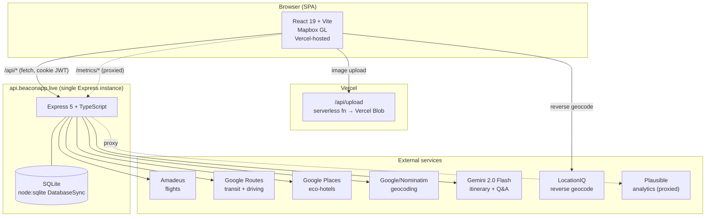
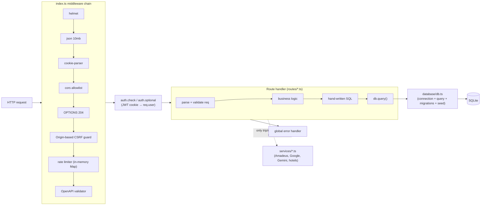
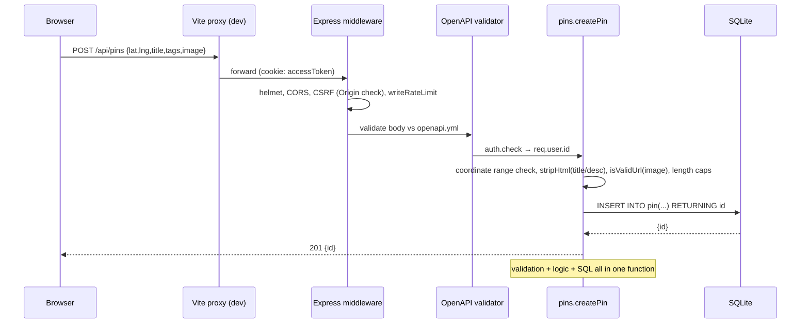
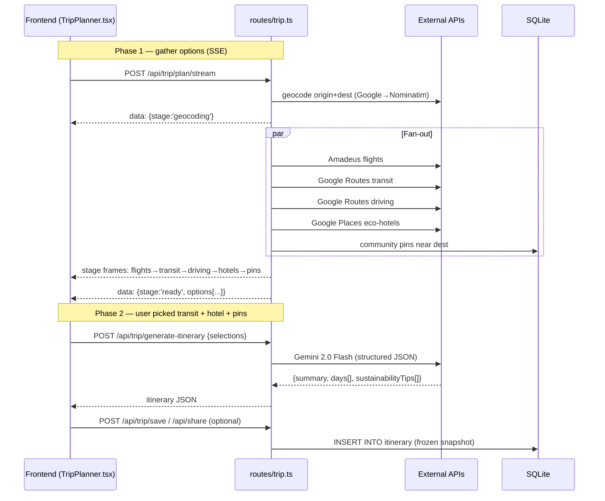
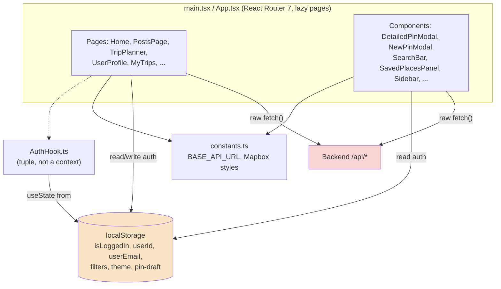
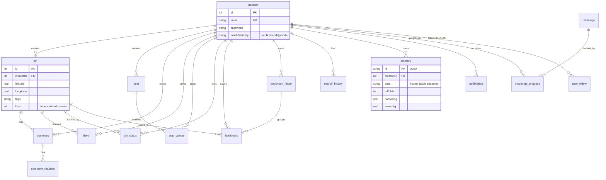

# Beacon — Current-State Architecture

> **Audience:** a maintainer inheriting Beacon.
> **Purpose:** an accurate map of how the system is built *today*, how data flows through it, and an honest Separation-of-Concerns (SoC) assessment.
> **Method:** every claim below is grounded in the source tree (file:line citations), not in the pre-existing `CLAUDE.md`, which has drifted from the code.
>
> Companion document: [`REMEDIATION.md`](./REMEDIATION.md) — the recommended end-state and a phased path to get there.

---

## 1. System overview

Beacon is a sustainable-travel + local-discovery app. Two product surfaces sit on one backend:

- **Map/social layer** — users drop pins, like/comment, follow each other, bookmark places.
- **AI trip planner** — compares transport options by carbon footprint, then generates a Gemini itinerary.

**Deployment shape:** the frontend is a static SPA on Vercel; the backend is a **single-instance** Express server (this matters — see the in-memory rate limiter, §3). In dev, Vite proxies `/api/*` to `localhost:3000`; in prod the SPA calls `https://api.beaconapp.live` directly.

---

## 2. Monorepo & tech stack

pnpm workspaces, two packages:

| Package | Stack | Entry |
|---------|-------|-------|
| `Frontend/` | React 19, Vite 7, TypeScript, Tailwind 4, Mapbox GL, React Router 7 | `src/main.tsx` |
| `Backend/` | Express 5, TypeScript (`tsx`), `node:sqlite`, JWT, bcrypt, Google GenAI SDK | `index.ts` |

Root scripts run both in parallel (`pnpm dev`). The API contract is described once in `Backend/openapi.yml` (~115 KB) and enforced at runtime by `express-openapi-validator`.

**Reality check vs. `CLAUDE.md`:** the codebase has grown beyond the documented 12 tables / route set. There are now **16 tables** and additional route modules: `challenges.ts`, `leaderboard.ts`, `notifications.ts`, `trips.ts` (saved trips / carbon stats), plus the large `trip.ts` (live planning). Treat the source as truth.

---

## 3. Backend architecture (as-is)

The backend follows an **MVC-ish "fat controller"** shape. `index.ts` is the composition root; each route file exports handler functions that do everything from HTTP parsing to SQL.

### What lives where

| Layer | File(s) | Responsibility | Notes |
|-------|---------|----------------|-------|
| Composition root | `Backend/index.ts` (293 L) | middleware, rate limiter, CORS/CSRF, **all** route registration, error handler | one file does all wiring |
| Controllers **+** logic **+** data access | `Backend/routes/*.ts` (18 files) | parse request, validate, apply rules, **write raw SQL** | no separation — see below |
| DB helper | `Backend/database/db.ts` (529 L) | connection, generic `query()`/`transaction()`, **migrations + seed** | mixed concerns |
| External integrations | `Backend/services/*.ts` | Amadeus, Google Routes/Places, Gemini, hotels; + DB-touching `challenges`, `notifications` | cleanly isolated ✅ |
| Utilities | `Backend/utils/*.ts` | `carbon`, `geocoding`, `sanitize`, `visibility`, `logger`, `fetchWithTimeout`, `tripCarbon` | genuinely reused ✅ |
| Contract | `Backend/openapi.yml` | request/response schema | runtime-validated ✅ |

### The core structural issue: data access lives in controllers

Route handlers embed SQL directly. Count of direct `db.query()` calls per route file:

| Route | `query()` calls | Route | `query()` calls |
|-------|:--:|-------|:--:|
| `comments.ts` | 17 | `likes.ts` | 7 |
| `bookmarks.ts` | 15 | `follows.ts` | 6 |
| `pins.ts` | 13 | `pinStatus.ts` | 5 |
| `stats.ts` | 12 | `notifications.ts` | 5 |
| `posts.ts` | 12 | `auth.ts` | 4 |
| `users.ts` | 10 | | |
| `search.ts` | 9 | | |

There is **no repository or model layer** for domain data. `services/` exists but holds only external-API clients (plus `challenges`/`notifications`, which reach into the DB directly). So a single handler mixes four concerns. Representative example — `Backend/routes/pins.ts` `getAllPins` (lines 30–144):

- **HTTP parsing** — reads `req.query.tags/minDate/maxRating/...` (30–47)
- **Business rules** — dynamic WHERE-clause building, rating post-filter, distance sort (54–141)
- **Data access** — hand-written SQL with a computed `likes` subquery + outer wrapper query (92–122)
- **Cross-cutting** — visibility enforcement via `visibilityFilter()` (86–88)

The same pattern repeats in `createPin`/`updatePin`/`deletePin` (210–377), including a copy-pasted **ownership check** (`SELECT creatorID … then compare`, e.g. 288–294 and 364–369) that recurs across `posts.ts`, `comments.ts`, `bookmarks.ts`.

### Other backend observations

- **Validation is triple-sourced.** `openapi.yml` validates shape at the edge, then handlers *re-validate* by hand (length caps `MAX_TITLE_LENGTH` etc., `isValidUrl`, coordinate range checks — `pins.ts` 7–19, 210–256), and the DB has its own `CHECK`/`VARCHAR` constraints. Three places to keep in sync.
- **`db.ts` mixes three jobs:** opening the connection (11–15), the generic `query()`/`transaction()` helpers (17–42), and **schema migrations + hard-coded seed data** run on startup (`initPostsTable` inserts "Taco Bell", "Matcha Labubu Cafe"… at 44–73; `runMigrations` does idempotent `ALTER TABLE` from line 75). Migrations are **not versioned files** — schema history is not tracked in git.
- **Denormalised counter.** `pin.likes` is maintained in-place while the `likes` table stays authoritative — a documented cache that can drift.
- **In-memory rate limiter** (`index.ts` 50–113): a `Map` with three tiers (auth 10/15min, trip 20/min, write 120/min, share 100/min) and a size cap. Correct only for a **single instance**; it resets on redeploy and won't work behind >1 replica.
- **Good hygiene worth preserving:** `helmet`, SameSite-strict cookie + Origin-based CSRF guard (`index.ts` 142–156), bcrypt(12), `stripHtml` on user text, `visibilityFilter` applied consistently to pin reads, `db.transaction()` for multi-statement writes.

### Request lifecycle — dropping a pin (write path)

### Data flow — two-phase AI trip planner

Phase 1 aggregates options over SSE (so the expensive Gemini call only happens once the user has chosen). Stages emitted in `trip.ts` (`stage: 'geocoding' → 'flights' → 'transit' → 'driving' → 'hotels' → 'pins' → 'ready'`, or `'error'`; see lines 289–453, 627).

---

## 4. Frontend architecture (as-is)

React SPA, React Router 7 with `createBrowserRouter`; all pages except Landing are lazy-loaded. **No global state library, no API client, no auth context.** Server data is fetched ad hoc inside components and auth state is read from `localStorage` wherever it's needed.

### Evidence

- **No API layer.** Raw `fetch()` appears in **~28 files**; heaviest: `DetailedPinModal.tsx` (13 calls), `SavedPlacesPanel.tsx` (7), `TripPlanner.tsx` (6), `SearchBar.tsx` (6). Each re-implements `credentials:"include"`, 401 handling, and error handling. There is no `Frontend/src/api/` directory.
- **Fetch + reshape + render in one component.** `PostsPage.tsx` (15–48) fetches `/api/posts`, then remaps server fields inline — `message`→`description`, `location`→`address`, defaults `tags`/`comments` — because there's no shared DTO/mapper (34–40). The 401 branch is a no-op (`return`) with the redirect commented out (23–26).
- **Auth state is scattered, not centralised.** `localStorage` is read directly in many files (`AuthHook.ts` 9 refs, `Home.tsx` 8, `LocationPin.tsx` 6, `NewPinModal.tsx` 3…). `AuthHook.ts` returns a **positional tuple** `[userEmail, userId, isLoggedIn, logout, authSuccess]` (39) rather than a context/provider, so it can't be shared across the tree without prop-drilling.
- **God components.** `TripPlanner.tsx` **1389 LOC**, `Home.tsx` **1213**, `DetailedPinModal.tsx` **954**, `NewPinModal.tsx` **596**, `SearchBar.tsx` 417. These fuse map/UI state, data fetching, business logic, and rendering.
- **No server-state caching.** Every mount refetches; no dedup, no cache invalidation, no optimistic updates.
- **Dead code** left in place (e.g. the commented-out `handleAddPost` block, `PostsPage.tsx` 56+; stray `*.css.bak` files under `src/pages/`).
- **Config is centralised** in `constants.ts` (`BASE_API_URL`, Mapbox layer styles) ✅ — a small bright spot.

---

## 5. Data model

16 tables (from `Backend/database/create.sql`, plus idempotent startup migrations). All FKs are `ON DELETE CASCADE` except `bookmark.folderID` (`SET NULL`).

Notes: `pin.likes` is a denormalised cache over the `likes` table. `itinerary.data` stores a **frozen JSON snapshot** — shared itineraries are intentionally immutable. `profileVisibility` exists and is enforced on pin reads via `visibilityFilter`, but enforcement is only partial across all user-facing endpoints (in-progress).

---

## 6. Separation of Concerns — assessment

**Verdict in one line:** Beacon is a *working, security-conscious* app with good utility hygiene and cleanly isolated external integrations — but its **domain logic and data access are fused into controllers (backend) and into components (frontend)**. That fusion is the central architectural debt: it makes handlers/components large, business rules untestable in isolation, and change risky.

### Scorecard

| Concern | Where it lives today | Rating | Evidence |
|---------|---------------------|:------:|----------|
| **API contract** | `openapi.yml`, runtime-validated | 🟢 Good | single source, validated at edge (`index.ts` 163–169) |
| **External integrations** | `services/*.ts` | 🟢 Good | Amadeus/Google/Gemini isolated behind modules |
| **Config** | `constants.ts` (FE), env vars (BE) | 🟢 Good | `BASE_API_URL`, Mapbox styles centralised |
| **Cross-cutting utils** | `utils/*.ts` | 🟡 Mixed | `carbon`/`sanitize`/`visibility` reused ✅, but ownership check & tag parsing copy-pasted in handlers |
| **Security middleware** | `index.ts` | 🟡 Mixed | correct (helmet/CSRF/bcrypt/rate limit) but all wiring + routes in one 293-line file |
| **Business logic (BE)** | inside `routes/*.ts` handlers | 🔴 Poor | rules interleaved with SQL & HTTP; no service layer |
| **Data access (BE)** | raw SQL inside handlers | 🔴 Poor | 100+ inline `db.query()` calls; no repository/model |
| **Validation** | 3 places (OpenAPI + handler + DB) | 🔴 Poor | duplicated, must be kept in sync manually |
| **Data fetching (FE)** | raw `fetch()` in ~28 files | 🔴 Poor | no client; auth/401/error re-implemented each time |
| **State management (FE)** | component `useState` + `localStorage` | 🔴 Poor | no context/store, no server-state cache |
| **Presentation (FE)** | god components | 🔴 Poor | fetch + reshape + logic + render fused; 4 files >590 LOC |
| **DB lifecycle** | `db.ts` | 🔴 Poor | connection + query helper + migrations + seed in one file; unversioned migrations |

Legend: 🟢 sound · 🟡 works but leaky · 🔴 concern.

### Consequences (why this matters for a new maintainer)

1. **Testing** — business rules can't be unit-tested without spinning up HTTP + SQLite; today's tests are integration-level (25 files) and slow to extend.
2. **Change risk** — editing a query means editing a controller; a schema change ripples across many hand-written SQL strings.
3. **Onboarding** — logic for one domain is spread across a huge handler; the frontend god components are hard to reason about.
4. **Scaling** — the in-memory rate limiter and on-startup migrations assume exactly one backend instance.
5. **Drift** — three validation sources and a denormalised counter each introduce a place where truth can diverge.

The good news: the seams to fix this already exist (`services/`, `utils/`, `openapi.yml`, `db.transaction`). [`REMEDIATION.md`](./REMEDIATION.md) lays out the target and a low-risk, phased path.
