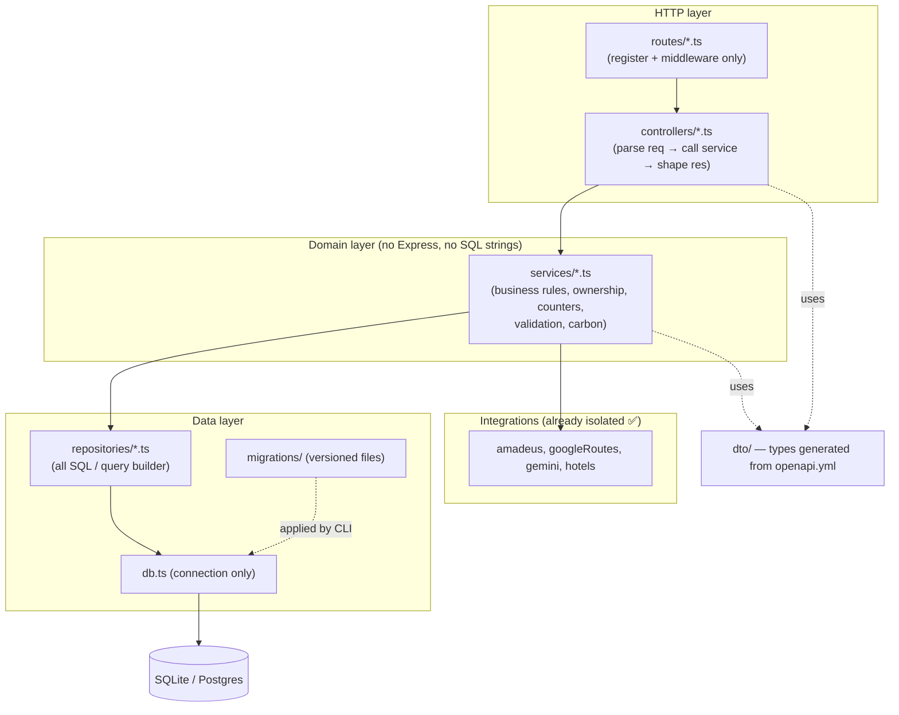
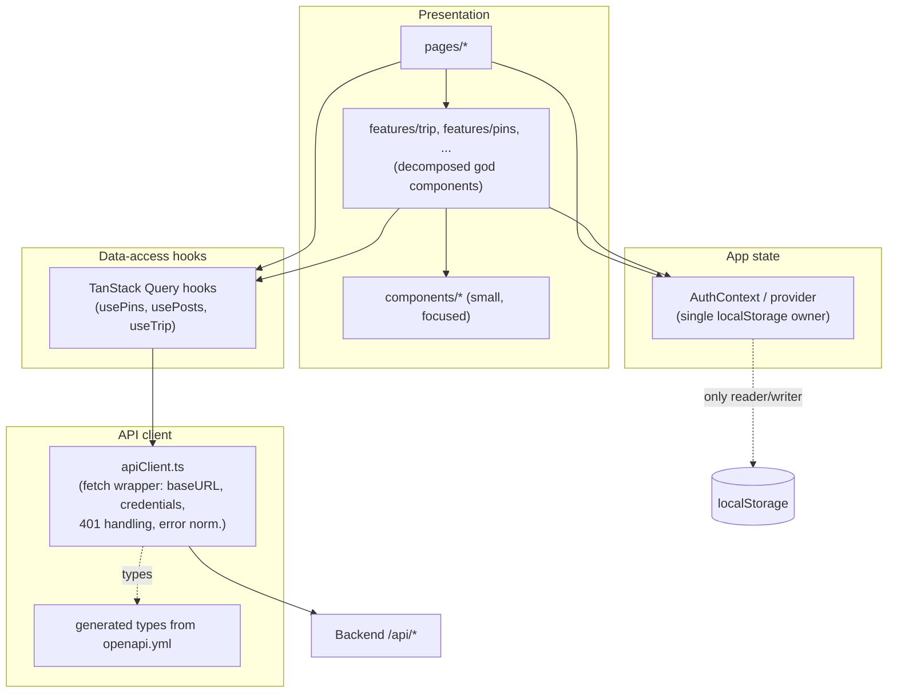
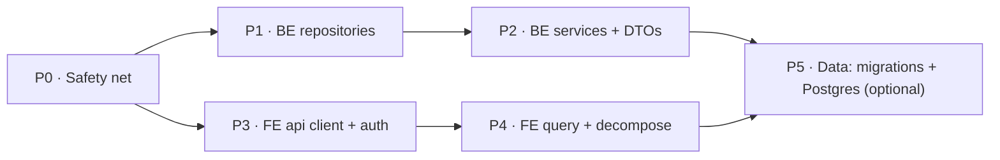

# Beacon — Architecture Remediation Plan

> **Companion to** [`ARCHITECTURE.md`](./ARCHITECTURE.md) (current state + SoC assessment).
> **Goal:** describe the recommended industry-standard **end-state**, then a **pragmatic, phased path** to reach it without a rewrite.
>
> **Core problem to solve** (from the SoC assessment): domain logic and data access are fused into controllers on the backend and into components on the frontend. Everything below is in service of pulling those concerns apart along clean seams.

---

## 1. Guiding principles

1. **Single Responsibility per layer** — a controller handles HTTP, a service holds business rules, a repository owns SQL. A React component renders; a hook fetches; a client speaks HTTP.
2. **Dependency direction points inward** — outer layers (HTTP, DB drivers, UI) depend on inner ones (domain logic), never the reverse. Business rules must be testable with no Express and no SQLite.
3. **One source of truth for the contract** — `openapi.yml` already exists; generate types from it for both sides instead of hand-writing DTOs three times.
4. **Strangler-fig, not big-bang** — wrap and migrate one domain at a time; every phase ships independently and keeps the app green.
5. **Behaviour-preserving refactors first** — move code before changing it; leaning on the existing test suite as the safety net.

---

## 2. Target end-state — Backend

A conventional layered architecture. Controllers become thin; a **service layer** holds business rules; a **repository layer** owns all SQL; DTOs sit at the HTTP boundary.

Key moves:
- **Repository layer** — one module per aggregate (`pinRepo`, `postRepo`, `commentRepo`, `userRepo`, …). All `db.query()` calls move here. A shared `findOwned(table, id, userID)` kills the copy-pasted ownership check.
- **Service layer** — business rules extracted from handlers: validation helpers, denormalised-counter maintenance, visibility, trip orchestration. Pure functions where possible → fast unit tests.
- **Thin controllers** — parse/validate input (against generated DTOs), call a service, format the response. No SQL, no rules.
- **Generated DTOs** — run a generator over `openapi.yml` so request/response types are shared, eliminating the triple-validation drift.
- **`index.ts` decomposition** — split middleware setup, the rate limiter, and route registration into separate modules; `index.ts` just composes them.
- **Optional bigger step (only if scale demands it):** move from `node:sqlite` to **Postgres** with a typed query builder / ORM (**Drizzle**, **Kysely**, or **Prisma**) and **versioned migrations**, replacing the on-startup `ALTER TABLE` pattern. Also externalise the rate limiter (Redis) so the backend can run >1 instance.

---

## 3. Target end-state — Frontend

Layer the client the same way: components render, hooks own data flow, a single typed client speaks to the API, and cross-cutting state lives in context/cache — not `localStorage` reads sprinkled everywhere.

Key moves:
- **`apiClient.ts`** — one wrapper that sets `baseURL`, `credentials:"include"`, normalises errors, and centralises the 401 policy. Every `fetch()` in ~28 files routes through it.
- **`AuthContext`** — the single reader/writer of `localStorage` auth keys; replaces the positional-tuple `AuthHook` and scattered reads. Components consume `useAuth()`.
- **TanStack Query** — server-state caching, dedup, invalidation, optimistic updates. Removes hand-rolled loading/error/refetch code from every component.
- **Feature decomposition** — break `TripPlanner` (1389 L), `Home` (1213 L), `DetailedPinModal` (954 L) into `features/*` folders (sub-components + hooks). Move the `PostsPage` field-remap into a shared mapper (or fix the API to return the right shape).
- **Delete dead code** — commented blocks, `*.css.bak`, DB `.bak` files.

---

## 4. Phased migration path

Each phase is independently shippable, ordered by risk and dependency. Backend P1→P2 and frontend P3→P4 can proceed in parallel once P0 is done.

| Phase | Scope | Key actions | Ships when | Risk |
|:--:|-------|-------------|-----------|:--:|
| **P0** | Safety net | Tighten `tsconfig`/ESLint; add tests around code about to move (pins, posts, comments); delete dead code + stray `.bak`/DB-backup files; document current behaviour. | Suite green, junk removed | 🟢 Low |
| **P1** | BE repositories | Introduce `repositories/`; move raw SQL out of handlers **with zero behaviour change**. Add shared `findOwned()`. **Pilot on `pins.ts`**, then posts/comments/likes/users. | Handlers call repos, tests still pass | 🟢 Low |
| **P2** | BE services + DTOs | Extract `services/` for business rules (validation, counters, visibility, trip orchestration); controllers go thin. Generate DTO types from `openapi.yml`; drop hand-rolled per-handler validation. | Controllers are thin; one validation source | 🟡 Med |
| **P3** | FE api client + auth | Add `apiClient.ts`; migrate pages off raw `fetch` **one at a time** (start `PostsPage`). Add `AuthContext`; make it the only `localStorage` auth owner. | All fetches routed; auth centralised | 🟡 Med |
| **P4** | FE query + decompose | Adopt TanStack Query for server state; decompose god components into `features/*`. | Components small; caching in place | 🟡 Med |
| **P5** | Data (optional) | Versioned migrations replacing startup `ALTER`; evaluate Postgres + query builder/ORM; externalise rate limiter (Redis) for multi-instance. | Only if scale/HA needed | 🔴 High |

**Why this order:** P0 makes every later move safe. Repositories (P1) are a pure mechanical extraction — lowest risk, biggest immediate readability win — and they *unblock* services (P2). On the frontend, the client + auth context (P3) are prerequisites for a clean Query adoption and component split (P4). P5 is deliberately last and optional — don't take on a DB migration until the layering makes it cheap and a real scale need exists.

---

## 5. Risks, sequencing & tactics

- **Keep phases behaviour-preserving.** P1 and P3 must not change outputs — they only relocate code. Lean on P0's tests; diff API responses before/after.
- **One domain at a time (strangler-fig).** Migrate `pins` end-to-end (repo → service → FE hook) as a vertical slice to prove the pattern before scaling out. Mixed old/new styles coexisting is fine mid-migration.
- **Parallelisation.** After P0: one person on BE (P1→P2), one on FE (P3→P4). They meet at the generated DTOs (shared contract).
- **Don't rewrite `openapi.yml`** — it's an asset. Generate from it; don't replace it.
- **P5 is a trap if taken early.** Postgres/ORM migration is high-value only after the repository layer exists (then the DB swap touches ~one layer, not 100 call sites).
- **Rollback:** each phase is a small PR series behind the green test suite; revert is a single PR.

---

## 6. Quick wins vs. structural work

**Quick wins (hours–days, do first):**
- Delete dead code, `*.css.bak`, and DB `.bak`/backup files committed in the tree.
- Extract the copy-pasted **ownership check** into one helper (`utils/ownership.ts`) — used by pins/posts/comments/bookmarks today.
- Add `apiClient.ts` and migrate the 3–4 simplest pages onto it (immediate consistency for 401/error handling).
- Replace the positional-tuple `AuthHook` with a typed `AuthContext` (removes prop-drilling, one `localStorage` owner).
- Turn on stricter `tsconfig`/ESLint and fix the fallout.

**Structural (weeks, sequenced per §4):**
- Repository layer (P1) and service layer (P2) on the backend.
- TanStack Query + god-component decomposition (P4) on the frontend.
- Versioned migrations and the optional Postgres move (P5).

---

### Definition of done

- Backend: no `db.query()` outside `repositories/`; controllers contain no business rules; validation has one source.
- Frontend: no raw `fetch()` outside `apiClient.ts`; no `localStorage` auth reads outside `AuthContext`; no component over ~400 LOC.
- Data: schema changes go through versioned migration files, not startup `ALTER`.
- Throughout: the existing test suite stays green, extended with fast unit tests for the new service layer.
